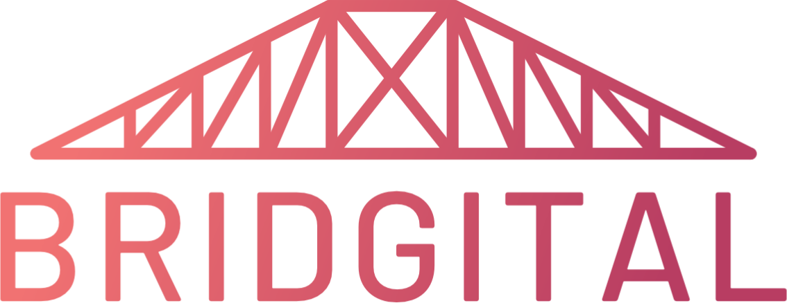

    

# Bridgital Inquiry

**Making engineering, math, and logic explorations fun through bridge building!**

Bridigital provides a simple web interface to design and prototype bridges for stress testing.
Inspired by the [Bridge Building](https://www.soinc.org/bridge-building-c) Science Olympiad
competition, Bridgital allows explorers to design their bridges and test them under any weight
load and any timeframe. This allows bridges to be prototyped and built without needing to consider
the cost of materials or the number of design iterations a bridge builder might go through. Bridgital
understands real world physics to simulate real bridge stress testing without the explorer needing to
have an advanced understanding of these concepts.

We hope to use Bridgital as a constructionist learning environment and microworld to support the
development of computational thinking skills.

*Created by Tommy McHugh*

**Made with :purple_heart: in Evanston, IL at the [Northwestern Inclusive Technology Lab](http://inclusive.northwestern.edu/)**
